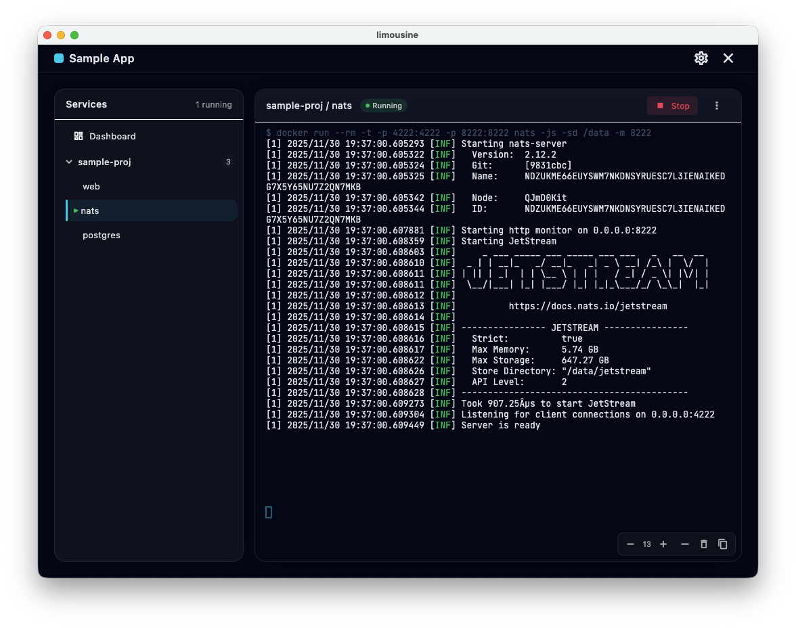

# Limousine - Development Microservice Orchestrator

Orchestrate local services for development: uvicorn, docker, etc.:

  - start/stop processes with stdout/stderr logs
  - load/compare environment files
  - clone missing workspace projects




## Limousine Workspaces and projects

The workspace file ends in `wksp` and should list projects, including
relative folder for each project and an optional git repo source to
clone from:

```json
{
  "name": "Sample App",
  "projects": {
    "sample-proj": {
      "path-on-disk": ".",
      "optional-git-repo-url": "git+ssh://git@github.com/example/sample-proj.git"
    }
  },
  "collapsed-modules": []
}
```

Each project referenced should contain a `limousine.proj` file
specifying modules and services. Each service can contain multiple
commands, which can be started/stopped from the UI:

```json
{
  "modules": {
    "sample-proj": {
      "services": {
        "web": {
          "commands": {
            "start": "npm run dev"
          }
        },
        "nats": {
          "commands": {
            "start": "docker run --rm -t -p 4222:4222 -p 8222:8222 nats -js -sd /data -m 8222"
          }
        },
        "postgres": {
          "commands": {
            "start": "docker run --rm -t --name postgres -p 5432:5432 -e POSTGRES_USER=postgres -e POSTGRES_PASSWORD=$DB_PASSWORD -e POSTGRES_DB=sample-db postgres:15-alpine"
          }
        }
      }
    }
  }
}
```

## Running

Start using flutter:

```bash
    flutter run -d macos
    
    flutter run -d linux
```


